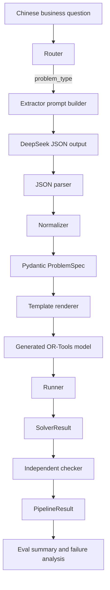

# NL2OPT Architecture

## Module Responsibilities

| Module | Responsibility |
| --- | --- |
| Router | Classifies Chinese input into `production`, `assignment`, `jobshop`, `vrp`, or `unsupported`. Current implementation is rule-based. |
| Extractor | Builds prompt, calls `LLMClient`, parses JSON, validates extracted data against the selected Pydantic schema. |
| Normalizer | Performs deterministic field-name normalization for common LLM aliases before schema validation. It does not invent missing numbers. |
| ProblemSpec / Schema | Defines strict Pydantic models for the four supported optimization problem types. Extra fields are forbidden. |
| Solver / OR-Tools | Uses Jinja2 templates to generate OR-Tools code for the selected schema and runs it locally through the runner. |
| Checker | Independently recomputes feasibility and objective consistency from the original spec and solver result. |
| Evaluator | Runs router + extractor + pipeline across JSONL case sets and computes pass rates. |
| Failure analysis | Reads live eval artifacts and summarizes failure stages such as schema validation, checker failure, objective mismatch, or missing output. |

## Flow

## Why Not Let The LLM Write OR-Tools Code Directly?

The project deliberately separates extraction from modeling. The LLM extracts structured data: entities, parameters, objective, and constraints. OR-Tools modeling is handled by fixed templates that are versioned and tested.

This reduces three risks:

- The LLM cannot silently change solver logic or generate unreviewed Python code.
- Schema validation catches missing or malformed fields before execution.
- The same `ProblemSpec` can be tested, rendered, run, and checked consistently across many cases.

## Why Checker Exists

A solver result is not automatically trustworthy in an LLM pipeline. The checker recomputes feasibility from the original `ProblemSpec` and the returned `SolverResult`.

Examples:

- production: recompute resource usage and objective value.
- assignment: verify every task is assigned once, capacity is respected, and cost is correct.
- jobshop: verify precedence, machine non-overlap, durations, and makespan.
- vrp: verify depot start/end, customer coverage, vehicle capacity, route distances, and total distance.

This makes failures easier to diagnose: a case can fail at extraction, schema validation, solving, checker validation, or objective matching.
